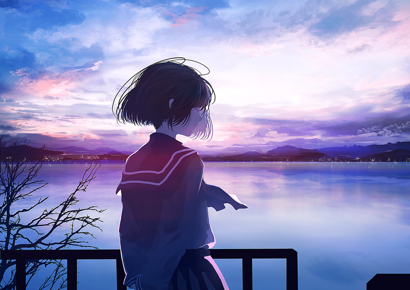

# <font style="color:3FEBF3">Anime API URL'S</font><br>


<ul>

<li>/api/anime
<ul>
<li>tüm dataları görüntülemek için --> /get-all-animes</li>
<li>yeni bir veri eklemek için --> /add-new-anime</li>
<li>tek bir verinin gösterilmesi için -->/get-anime/:id</li>
<li>verinin güncellenmesi için -->/update-anime/:id</li>
<li>verinin silinmesi içinde -->/delete-anime/:id</li>
</ul>
</li>


<li>/api/characters/

<ul>
<li>tek karakteri göstermek için --> /show-character/:name</li>
<li>yeni karakter verisi eklemek için --> /add-new-character/:id</li>
<li>koleksiyon içindeki karakteri güncellemek için --> /update-character/:id</li>
<li>koleksiyon ve character dizisinden veriyi silmek için --> /:id/delete-character/:name</li>
</ul>

</li>

<li>/api/season

<ul>
<li>tek sezon bilgisini göstermek için --> /:id/show-one-season/:id</li>
<li>yeni sezon bilgisini girmek için --> /add-new-season/:id</li>
<li>sezon bilgisini koleksiyon ve seasons dizisinden silmek için --> /:id/delete-season/:name</li>

</ul>
</li>

</ul>


# <font style="color:3FEBF3">Anime Verisi Gönderme İşlemi</font>

#### <font style="color:52F7AC">Veritabanındaki tüm objeleri çağırmak</font>
	http://localhost:8000/api/anime/get-all-anime

#### <font style="color:52F7AC">Anime verisini veritabanına yollama</font>

	http://localhost:8000/api/anime/add-new-anime
```json
{
    "Title": "classroom of the elites",
    "Description": "Yōkoso Jitsuryoku Shijō Shugi no Kyōshitsu e, Shōgo Kinugasa tarafından yazılan bir light novel serisidir. Seri, Mayıs 2015 tarihinden bu yana Media Factory'nin MF Bunko J baskısı altında yayımlanmaktadır.",
    "Genres": ["Sürükleyici","Psikoloji","Gerilim"],
    "Pictures": [],
    "NumOfVol": 24,
    "doesItContinue" : "devam ediyor",
    "Director":"Seiji Kishi",
	"Characters":[],
	"Seasons" : [],
	"Writer":"Syougo Kinugasa"
}
```
anime ile alakalı ilk veriyi veritabanına dizileri boş olarak yolluyoruz

#### <font style="color:52F7AC">Anime verisini silme</font>

	http://localhost:8000/api/anime/delete-anime/:id 
bu url isteğini yolladığımız zaman doğru Object id girildiyse bize bu json verisi döner
```json
{
	"message" : "Data with id ${req.params.id} deleted from database"
}
```

#### <font style="color:52F7AC">Anime verisini güncellemek</font>
	http://localhost:8000/api/anime/update-anime/:id

bu url isteğini yolladığın zaman Object id doğru girildiyse bu json verisi döner.<br>

```json
	"message": "Updated data with id ${req.params.id}"
```

# <font style="color:3FEBF3">Karakter Verisi Gönderme İşlemi</font>

#### <font style="color:52F7AC">Karakter objesini veritabanına yollama</font>

	http://localhost:8000/api/characters/add-new-character/:id
```json
{
	"name":"Kiyotaka",
	"surname":"ayonokoji",
	"age":17,
	"picture":["https://i1.sndcdn.com/artworks-9Fqfh06DgQjyY1Dm-RwXqDw-t500x500.jpg"],
	"about":"devil",
	"birthdate":"unknown",
	"height":174,
	"weight":65
}
```

bu json verisini veritabanına yolladığın zaman alacağın json tipindeki mesaj :
```json
	"message" : "process is successful new character model add to set"
```

#### <font style="color:52F7AC">Karakter objesini veritabanı ve Anime'nin <font style="color:F1A94E">Characters</font> Dizisinden Silinmesi</font>

	http://localhost:8000/api/characters/:id/delete-character/:name
parametreler doğru girilirse geri dönen json mesajı :
```json
	"message" : "the character named ${req.params.name} has been deleted from Character collection"
```

# <font style="color:3FEBF3">Sezon verisini gönderme işlemi</font>

#### <font style="color:52F7AC">Sezon objesini veritabanına gönderme </font>
	http://localhost:8000/api/season/add-new-season/:id
```json
{
	"seasonName":"Classroom of the Elite, season 1",
	"seasonDescription":"Classroom of the Elite, aynı adı taşıyan hafif romandan uyarlanan ve Shōgo Kinugasa tarafından yazılan ve Shunsaku Tomose tarafından çizilen bir anime dizisidir.",
	"seasonNumberEpisode":12,
	"seasonPictures":["https://m.media-amazon.com/images/M/MV5BMDZmYjc0NDMtM2VkNy00Yjc2LThiMGQtYjJkOWRiNzdlODQxXkEyXkFqcGdeQXVyNjc3NTI5MDY@._V1_.jpg"],
	"seasonStudio":"Lerche"
}
```
parametreler doğru girildiyse geriye döndürülecek json mesajı :
```json
	"message" : "Saving season data to database successful"
```
#### <font style="color:52F7AC">Sezon objesinin veritabanından ve <font style="color:F1A94E">Seasons</font> Dizisinden Silinmesi</font>
	http://localhost:8000/api/season/:id/delete-season/:name
parametreler doğru girildiyse geriye döndürülecek json mesajı :
```json
	"message" : "the character named ${req.params.name} has been deleted from Season collection"
```


